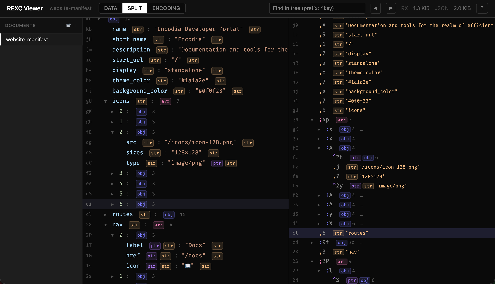

# RX Data Store

[](https://github.com/creationix/rx/actions/workflows/rx-test.yml)

RX is an embedded data store for JSON-shaped data. Encode once, then query the encoded document in place — **no parsing, no object graph, no GC pressure**. Think of it as *no-SQL SQLite*: unstructured data with database-style random access.

```json
[ { "color": "red", "fruits": [ "apple", "cherry" ] },
  { "color": "yellow", "fruits": [ "apple", "banana" ] } ]
```

When encoding as RX, pointers deduplicate automatically: `^z` reuses "apple", `^h` reuses the shared key layout. The encoded form is queryable as-is — no parsing step, just direct reads from the buffer.

```rexc
banana,6apple,5;ffruits,6yellow,6color,5:Echerry,6^z;ared,3^h:j;_
```

Benchmarked on a real **92 MB deployment manifest** with 35,000 route keys:

| | JSON | RX |
|---|------|-----|
| **Size** | 92 MB | 5.1 MB |
| **Look up one route** | 69 ms (full parse) | 0.003 ms (~16 index hops) |
| **Heap allocations** | 2,598,384 | ~10 |

---

## When to use RX

RX sits in a specific gap: your data is **too large** for JSON's parse-everything model, but **too unstructured** for SQLite or Protobuf.

**Good fits:**
- Build manifests, route tables, deployment artifacts — written once, read sparsely
- Embedded datasets in browsers, edge runtimes, or worker processes
- Any workflow where full-document parsing is the bottleneck

**Bad fits:**
- Small documents where JSON parsing is already cheap
- Human-authored config files
- Write-heavy or mutable data (use a real database)
- Minimizing compressed transfer size (gzip/zstd will beat RX)
- Data that maps cleanly to tables (use SQLite) or a fixed schema (use Protobuf)

## Typical workflow

1. A build or deploy step produces a large JSON-shaped artifact.
2. **Encode it to RX** once.
3. Runtimes read only the values they need — **O(1)** array access, **O(log n)** object key lookup.
4. When debugging at 3 AM, copy-paste the RX text into **[rx.run](https://rx.run/)** to inspect it. No binary tooling needed.

---

## Install

```sh
npm install @creationix/rx     # library
npm install -g @creationix/rx  # CLI (global)
npx @creationix/rx data.rx     # CLI (one-off)
```

## Quick start

### Encode

```ts
import { stringify } from "@creationix/rx";

const rx = stringify({ users: ["alice", "bob"], version: 3 });
// Returns a string — store it anywhere you'd store JSON text
```

### Decode

```ts
import { parse } from "@creationix/rx";

const data = parse(rx) as any;
data.users[0]         // "alice"  — no parse, direct buffer read
data.version          // 3
Object.keys(data)     // ["users", "version"]
JSON.stringify(data)  // works — full JS interop
```

The returned value is a **read-only Proxy**. It supports property access, `Object.keys()`, `Object.entries()`, `for...of`, `for...in`, `Array.isArray()`, `.map()`, `.filter()`, `.find()`, `.reduce()`, spread, destructuring, and `JSON.stringify()`. Existing read paths usually work unchanged.

### Uint8Array API

For performance-critical paths, skip the string conversion:

```ts
import { encode, open } from "@creationix/rx";

const buf = encode({ path: "/api/users", status: 200 });
const data = open(buf) as any;
data.path    // "/api/users"
data.status  // 200
```

`stringify`/`parse` work with strings. `encode`/`open` work with `Uint8Array`. Same options, same Proxy behavior.

### A more realistic example

The quick start above is tiny — JSON would be fine for it. RX pays off on **larger data with sparse reads**. Here's a site manifest (see [samples/](samples/) for full files):

```js
// site-manifest.json — 15 routes, repeated structure, shared prefixes
{
  "routes": {
    "/": { "title": "Home", "component": "LandingPage", "auth": false },
    "/docs": { "title": "Documentation", "component": "DocsIndex", "auth": false },
    "/docs/getting-started": { "title": "Getting Started", "component": "DocsPage", "auth": false },
    "/dashboard": { "title": "Dashboard", "component": "Dashboard", "auth": true },
    "/dashboard/projects": { "title": "Projects", "component": "ProjectList", "auth": true },
    // ... 10 more routes
  }
}
```

```ts
import { readFileSync } from "fs";
import { parse } from "@creationix/rx";

// The RX file is already smaller on disk (shared schemas, deduplicated
// component names, chain-compressed "/docs/..." and "/dashboard/..." prefixes).
// But the real win is at read time:

const manifest = parse(readFileSync("site-manifest.rx", "utf-8")) as any;
const route = manifest.routes["/dashboard/projects"];
route.title      // "Projects"
route.component  // "ProjectList"
route.auth       // true
// Only these three values were decoded. Everything else was skipped.
```

Scale this to 35,000 routes and the difference is **69 ms vs 0.003 ms** per lookup.

The [samples/](samples/) directory has four datasets showing different access patterns — route manifests, RPG game state, emoji metadata, and sensor telemetry. Start with *site-manifest* and *quest-log* if you're evaluating the format.

---

## Encoding options

```ts
stringify(data, {
  // Add sorted indexes to containers with >= N entries (enables O(log n) lookup)
  indexes: 10,       // default threshold; use 0 for all, false to disable

  // External refs — shared dictionary of known values
  refs: { R: ["/api/users", "/api/teams"] },

  // Streaming — receive chunks as they're produced
  onChunk: (chunk, offset) => process.stdout.write(chunk),
});
```

If the encoder used external refs, pass the same dictionary to the decoder:

```ts
const data = parse(payload, { refs: { R: ["/api/users", "/api/teams"] } });
```

## CLI

```sh
rx data.rx                         # pretty-print whole file (default action)
rx data.rx users 0 name            # show value at data.users[0].name
cat data.rx | rx                   # read from stdin (auto-detect)
rx convert data.json data.rx       # JSON → RX
rx convert data.rx data.rxb        # RX text → RX binary
rx convert data.rx - --to json     # write JSON to stdout
```

Output format defaults to **tree** when stdout is a terminal and **json** when piped or redirected. Override with `-f tree|json|rx|rxb` or set `RX_FORMAT`.

> **Tip:** Add a shell function for quick paged, colorized viewing:
> ```sh
> p() { rx "$1" -f tree -c | less -RFX; }
> ```

<details>
<summary><strong>Full CLI reference</strong></summary>

### Commands

| Command | Description |
|---------|-------------|
| `rx FILE [SEGMENT...]` | Pretty-print FILE, or value at path (shortcut for `rx show`) |
| `rx show [FILE \| -] [SEGMENT...]` | Pretty-print a file or a value at a path |
| `rx convert SRC DST` | Convert between formats; direction from extensions, or `--from` / `--to` |
| `rx help [COMMAND \| --all]` | Show help (`--all` for advanced commands) |

Advanced (`rx help --all`): `rx inspect`, `rx stats`, `rx demo`, `rx completions`.

### `show` options

| Flag | Description |
|------|-------------|
| `-f`, `--format FMT` | Output format: `tree` \| `json` \| `rx` \| `rxb` |
| `-w`, `--width N` | Target line width for tree (default: 80) |
| `-c`, `--color` / `--no-color` | Force or disable ANSI color |
| `-o`, `--output PATH` | Write to PATH instead of stdout |

### `convert` options

| Flag | Description |
|------|-------------|
| `--from FMT` | Input format when SRC is `-` (auto-detected from stdin content otherwise) |
| `--to FMT` | Output format when DST is `-` |
| `--tune-index-threshold N` | Index containers above N values (default: 16) |
| `--tune-chain-threshold N` | Split strings longer than N (default: 24) |
| `--tune-chain-delimiter S` | Delimiters for chain splitting (default: `/.`) |
| `--tune-dedup-limit N` | Max node count for structural dedup (default: 32) |

### Global

| Flag | Description |
|------|-------------|
| `-h`, `--help` | Show help (or `rx COMMAND --help` for a command) |
| `-v`, `--version` | Print version |

### Environment variables

| Variable | Description |
|----------|-------------|
| `RX_FORMAT` | Pin default output format regardless of TTY |
| `NO_COLOR` | Disable ANSI color when set |

### Shell completions

```sh
rx completions install            # auto-detect shell
rx completions install bash       # explicit
rx completions zsh > ~/.zsh/_rx   # print script to stdout
```

</details>

---

## Format

RX is a **text encoding** — not human-readable like JSON, but safe to copy-paste, embed in strings, and move through tools that choke on binary.

Every value is read **right-to-left**. The parser scans left past base64 digits to find a **tag** character, then uses the tag to interpret any **body** bytes further left:

```
[body][tag][b64 varint]
            ◄── read this way ──
```

*Railroad diagram coming soon — see [format spec](docs/rx-format.md) for all diagrams.*

| JSON | RX | What you're reading |
|------|----|---------------------|
| `42` | `+1k` | tag `+` (integer), b64 `1k` = 84, zigzag → 42 |
| `"hi"` | `hi,2` | tag `,` (string), b64 `2` = byte length, body `hi` to the left |
| `true` | `'t` | tag `'` (ref), name `t` → built-in literal |
| `[1,2,3]` | `+6+4+2;6` | tag `;` (array), b64 `6` = content size, three children to the left |
| `{"a":1,"b":2}` | `+4b,1+2a,1:a` | tag `:` (object), b64 `a` = content size, interleaved keys/values |

**Tags:** `+` integer · `*` decimal · `,` string · `'` ref/literal · `:` object · `;` array · `^` pointer · `.` chain · `#` index

The encoder automatically deduplicates values, shares object schemas, compresses shared string prefixes, and adds sorted indexes. See the **[format spec](docs/rx-format.md)** for the full grammar, railroad diagrams, and a walkthrough of how a complete object is encoded byte by byte.

[](https://rx.run/)

---

## Inspect API

`inspect()` returns a lazy AST that maps 1:1 to the byte encoding — pointers stay as pointers, chains as chains, indexes as indexes:

```ts
import { encode, inspect } from "@creationix/rx";

const buf = encode({ name: "alice", scores: [10, 20, 30] });
const root = inspect(buf);

root.tag          // ":"
root[0].tag       // "," (a string key)
root[0].value     // "name"
root.length       // 4 (key, value, key, value)

for (const child of root) {
  console.log(child.tag, child.b64);
}
```

Each node exposes: `tag`, `b64`, `left`, `right`, `size`, `data`, and `value` (lazy). Nodes with children (`:`, `;`, `.`, `*`, `#`) are iterable and support indexed access. Children are parsed lazily and cached.

**Semantic helpers** for object nodes:

```ts
for (const [key, val] of root.entries()) { ... }
for (const [key, val] of root.filteredKeys("/api/")) { ... }  // O(log n + m) on indexed objects
const node = root.index("name");   // key lookup
const elem = root.index(2);        // array index
```

## Low-level cursor API

For zero-allocation traversal without the Proxy layer, see **[docs/cursor-api.md](docs/cursor-api.md)**.

## Binary format (RXB)

RXB is a binary sibling format — same data model and right-to-left design as the text format, but with varint-tag encoding for smaller output and faster parsing. Use it when you don't need the copy-pasteable text property.

```ts
import { rxbEncode, rxbOpen, rxbDecode } from "@creationix/rx";

const buf = rxbEncode({ users: ["alice", "bob"], version: 3 });
const data = rxbOpen(buf) as any;
data.users[1];  // "bob"
```

The full reader and cursor API mirrors the text side with an `rxb` prefix: `rxbMakeCursor`, `rxbRead`, `rxbFindKey`, `rxbHandle`, etc. See **[docs/rxb-format.md](docs/rxb-format.md)** for the wire format.

## Proxy behavior

The value returned by `parse`/`open` is **read-only**:

```ts
obj.newKey = 1;      // throws TypeError
delete obj.key;      // throws TypeError
"key" in obj;        // works (zero-alloc key search)
obj.nested === obj.nested  // true (container Proxies are memoized)
```

Escape hatch to the underlying buffer:

```ts
import { handle } from "@creationix/rx";
const h = handle(obj.nested);
// h.data: Uint8Array, h.right: byte offset
```

---

## More

- **[docs/rx-format.md](docs/rx-format.md)** — text format spec, grammar, and railroad diagrams
- **[docs/rxb-format.md](docs/rxb-format.md)** — binary format spec
- **[docs/cursor-api.md](docs/cursor-api.md)** — low-level zero-allocation cursor API
- **[rx-perf.md](rx-perf.md)** — cursor internals, Proxy design, allocation profile
- **[samples/](samples/)** — example datasets with JSON/RX pairs
- **[rx.run](https://rx.run/)** — live web viewer

## License

MIT
