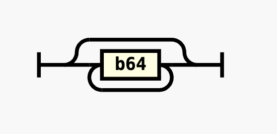
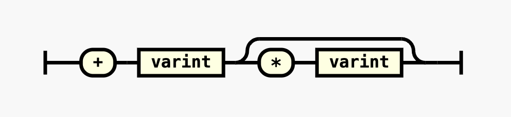
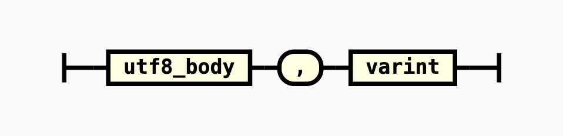
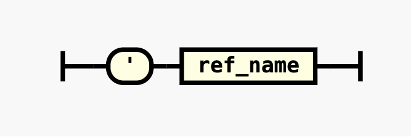
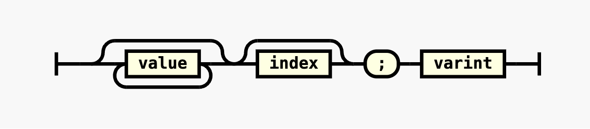
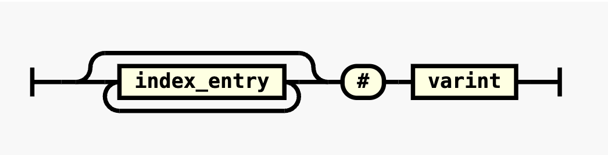

# RX Format Spec

This document is the formal grammar and encoding reference for the `.rx` text format used by `@creationix/rx`. It is intended to make the format understandable **without reading the source code**.

RX covers the same data model as JSON: maps, lists, strings, numbers, booleans, and `null`. Pointers, chains, refs, and indexes are encoding features that make large documents smaller and faster to query.

> For interactive inspection, paste any RX or JSON into the live viewer at **[rx.run](https://rx.run/)**.

---

## Reading direction

RX is parsed **right-to-left**. Every value has a **tag** character with a **base64 varint** to its right, and may have a **body** to its left:

```text
[body][tag][b64 varint]
            ◄── read this way ──
```

The parser starts at the rightmost byte and scans left past base64 digits until it hits a non-b64 byte — that byte is the tag. The b64 digits to its right are the varint. The tag then determines whether there is a body to the left and how to interpret it.

**Worked example** — parsing `hi,2`:

1. Start at the right: `2` is a b64 digit → varint = 2
2. Next byte left: `,` is not a b64 digit → **tag** (string)
3. The tag says there are 2 bytes of body to the left → `hi`

---

## Grammar overview

A **value** is one of:

```ebnf
value = number | string | ref | list | map | pointer | chain ;
```

### Tags at a glance

| Tag | Name | Layout | Description |
|-----|------|--------|-------------|
| **`+`** | Number | `+[b64 zigzag]` | Zigzag-decoded signed integer |
| **`*`** | Decimal | `[base]+[b64 base]*[b64 exp]` | `base × 10^exp` |
| **`,`** | String | `[UTF-8 bytes],[b64 length]` | Raw UTF-8, length in bytes |
| **`'`** | Ref | `'[name]` | Built-in literal or external ref name |
| **`;`** | List | `[children];[b64 content-size]` | Ordered child values |
| **`:`** | Map | `[children]:[b64 content-size]` | Key/value pairs |
| **`^`** | Pointer | `^[b64 delta]` | Backward delta to an earlier byte offset |
| **`.`** | Chain | `[segments].[b64 content-size]` | Concatenated string segments |
| **`#`** | Index | `[entries]#[b64 compound]` | Sorted lookup table for a container |

---

## Building blocks

### B64

```ebnf
b64
  = "0" | "1" | "2" | "3" | "4" | "5" | "6"
  | "7" | "8" | "9" | "a" | "b" | "c" | "d"
  | "e" | "f" | "g" | "h" | "i" | "j" | "k"
  | "l" | "m" | "n" | "o" | "p" | "q" | "r"
  | "s" | "t" | "u" | "v" | "w" | "x" | "y"
  | "z" | "A" | "B" | "C" | "D" | "E" | "F"
  | "G" | "H" | "I" | "J" | "K" | "L" | "M"
  | "N" | "O" | "P" | "Q" | "R" | "S" | "T"
  | "U" | "V" | "W" | "X" | "Y" | "Z" | "-"
  | "_"
  ;
```

RX uses the alphabet **`0-9 a-z A-Z - _`** (64 characters, URL-safe, no padding) for variable-length unsigned integers.

### Varint

```ebnf
varint = { b64 } ;
```



A `varint` is zero or more `b64` digits in big-endian order. These are used for unsigned integers, signed integers, and sometimes as string identifiers.

- **Zero** is encoded as an empty string (zero digits)
- **Signed integers** use zigzag encoding: 0 → 0, -1 → 1, 1 → 2, -2 → 3, ...

| Decimal | Zigzag | B64 digits |
|---------|--------|------------|
| 0 | 0 | *(empty)* |
| 1 | 2 | `2` |
| -1 | 1 | `1` |
| 42 | 84 | `1k` |
| 255 | 510 | `7-` |

---

## Primitives

### Number — `+` `*`

```ebnf
number = "+" , varint , [ "*" , varint ] ;
```



Numbers are encoded as a zigzag signed integer base optionally combined with a zigzag signed power of 10 exponent. When the exponent is small and non-negative, the encoder folds it into the base and omits the `*` suffix.

Special float values use refs instead: **`'inf`** (+Infinity), **`'nif`** (-Infinity), **`'nan`** (NaN).

| JSON | RX | Base | Exp | Notes |
|------|----|------|-----|-------|
| `0` | `+` | 0 | — | zigzag(0) = empty |
| `1` | `+2` | 1 | — | zigzag(1) = 2 |
| `-1` | `+1` | -1 | — | zigzag(-1) = 1 |
| `42` | `+1k` | 42 | — | zigzag(42) = 84 = `1k` |
| `255` | `+7-` | 255 | — | zigzag(255) = 510 = `7-` |
| `1000` | `+vg` | 1000 | — | small exp, folded into integer |
| `3.14` | `+9Q*3` | 314 | -2 | 314 × 10⁻² |
| `-0.5` | `+9*1` | -5 | -1 | -5 × 10⁻¹ |
| `99.9` | `+ve*1` | 999 | -1 | 999 × 10⁻¹ |
| `1000000` | `+2*c` | 1 | 6 | 1 × 10⁶ |

### String — `,`

```ebnf
string = utf8_body , "," , varint ;
```



The body contains raw UTF-8 bytes. The varint gives the **byte length** (not character count). Strings may contain any bytes including nulls and non-ASCII unicode.

| JSON | RX | Bytes | Notes |
|------|----|-------|-------|
| `""` | `,` | 0 | empty string |
| `"hi"` | `hi,2` | 2 | |
| `"alice"` | `alice,5` | 5 | |
| `"hello world"` | `hello world,b` | 11 | b64(11) = `b` |
| `"café"` | `café,5` | 5 | `é` is 2 UTF-8 bytes |
| `"🎉"` | `🎉,4` | 4 | emoji is 4 UTF-8 bytes |
| `"🏴‍☠️"` | `🏴‍☠️,d` | 13 | ZWJ pirate flag: 🏴 + ZWJ + ☠ + VS16 |

### Ref — `'`

```ebnf
ref = "'" , ref_name ;
```



Refs are **unique among tags**: the bytes after `'` are not a numeric value but a *name* composed of b64 digits. The parser checks for built-in names first; non-built-in ref names refer to entries in an external dictionary agreed between encoder and decoder.

| Value | RX | Name |
|-------|----|------|
| `true` | `'t` | `t` |
| `false` | `'f` | `f` |
| `null` | `'n` | `n` |
| `undefined` | `'u` | `u` |
| `+Infinity` | `'inf` | `inf` |
| `-Infinity` | `'nif` | `nif` |
| `NaN` | `'nan` | `nan` |

---

## Containers

### List — `;`

```ebnf
list = { value } , [ index ] , ";" , varint ;
```



Children are written in reverse order so that right-to-left parsing yields them in natural forward order (index 0 first). The varint gives the **total byte size** of the content region.

Large lists may include an **index** between the last child and the `;` tag.

| JSON | RX | Children (right-to-left parse order) |
|------|----|--------------------------------------|
| `[]` | `;` | *(none)* |
| `[1,2,3]` | `+6+4+2;6` | `+2` → 3, `+4` → 2, `+6` → 1 |

### Map — `:`

```ebnf
map = { value , value } , [ index ] , [ schema ] , ":" , varint ;
```

Key/value pairs are written in reverse order so that right-to-left parsing yields them in natural insertion order. **Key order is preserved.** Keys are typically strings but may be pointers or chains.

Large maps may include an **index** and/or a **schema** between the last key-value pair and the `:` tag. When both are present, the schema is rightmost, followed by the index.

| JSON | RX |
|------|----|
| `{}` | `:` |
| `{"a":1,"b":2}` | `+4b,1+2a,1:a` |
| `{"users":["alice","bob"],"version":3}` | `+6version,7bob,3alice,5;cusers,5:w` |

---

## Sharing and random access

### Pointer — `^`

```ebnf
pointer = "^" , varint ;
```

A pointer refers to an earlier value by **backward delta** — the distance in bytes from the pointer's tag position back to the target value's right edge. To resolve: `target = tag_position - delta`, then read the value at that offset.

Pointers enable:
- **Value deduplication** — identical strings, maps, or subtrees are written once
- **Schema sharing** — maps with the same keys reference a shared key layout

### Chain — `.`

```ebnf
chain = { value } , "." , varint ;
```

A chain is a **concatenated string** built from segments. Each segment is itself a value — typically a string, pointer, or another chain. The varint gives the total byte size of the segments.

Chains compress keys with shared prefixes. For example, `/docs/getting-started` and `/docs/encoding` might share a `/docs/` prefix segment via a pointer, with only the suffix differing.

### Index — `#`

```ebnf
index = { index_entry } , "#" , varint ;
index_entry = b64 , { b64 } ;
```



An index is a **sorted lookup table** attached to a container (list or map). It appears inside the container body, between the content and the container's tag.

The compound varint packs two values:

```
compound = (count << 3) | (width - 1)
```

- **Low 3 bits** → `width - 1` (digits per entry, supporting widths 1–8)
- **Upper bits** → `count` (number of entries)

Each entry is a fixed-width base64 number giving the backward delta from the index position to the corresponding child. For maps, entries point to keys and are **sorted in UTF-8 byte order**.

**Indexes enable:**
- **O(1) list access** — jump directly to the *N*th element
- **O(log n) map key lookup** — binary search on sorted keys
- **O(log n + m) prefix search** — find the first matching key, then scan forward

Without an index, list access and key lookup are O(n) linear scans.

### Schema

Maps can store their keys **separately from their values** using a schema reference. This is useful when many maps share the same key set (e.g., rows in a table-like structure).

```ebnf
schema = pointer | ref ;
```

A schema map stores only values in its content body. The schema node appears as the rightmost item inside the map (before any index). The parser identifies it by tag:

- **Pointer schema** (`^`) — points to another map or list whose keys become this map's keys
- **Ref schema** (`'`) — names an external dictionary entry containing the key list

The encoder detects shared key sets **automatically**. The first map with a given key set is encoded normally; subsequent maps with the same keys store only their values and a pointer back to the first map's key layout.

### External refs

Encoders and decoders can share an **external dictionary** of values. When a value matches a ref entry by identity, the encoder writes `'name` instead of the full value. The decoder looks up the name in the same dictionary to reconstruct the original value.

Refs are not part of the JSON data model. They are an agreed-upon external table — useful for values that appear across multiple documents or are too expensive to embed repeatedly.

---

## Encoding example walkthrough

Given this JSON:

```json
{"users":["alice","bob"],"version":3}
```

The RX encoding is:

```
+6version,7bob,3alice,5;cusers,5:w
```

Reading **right-to-left**:

| Step | Bytes | Tag | B64 | Decoded |
|------|-------|-----|-----|---------|
| 1 | `:w` | `:` map | `w` = 32 | content is 32 bytes to the left |
| 2 | `users,5` | `,` string | `5` = 5 | "users" — key₁ |
| 3 | `;c` | `;` list | `c` = 12 | content is 12 bytes — value₁ |
| 4 | `alice,5` | `,` string | `5` = 5 | "alice" — list element₁ |
| 5 | `bob,3` | `,` string | `3` = 3 | "bob" — list element₂ |
| 6 | `version,7` | `,` string | `7` = 7 | "version" — key₂ |
| 7 | `+6` | `+` number | `6` | zigzag 6 → **3** — value₂ |

---

## Versioning

This document describes the current encoding used by `@creationix/rx`. The format originated as the internal bytecode for *rex* (a DSL for HTTP routing), which is why pointers, chains, and indexing are first-class concepts.

Future versions may add new tags or encoding features. The **tag character set** and **right-to-left reading direction** are stable.
